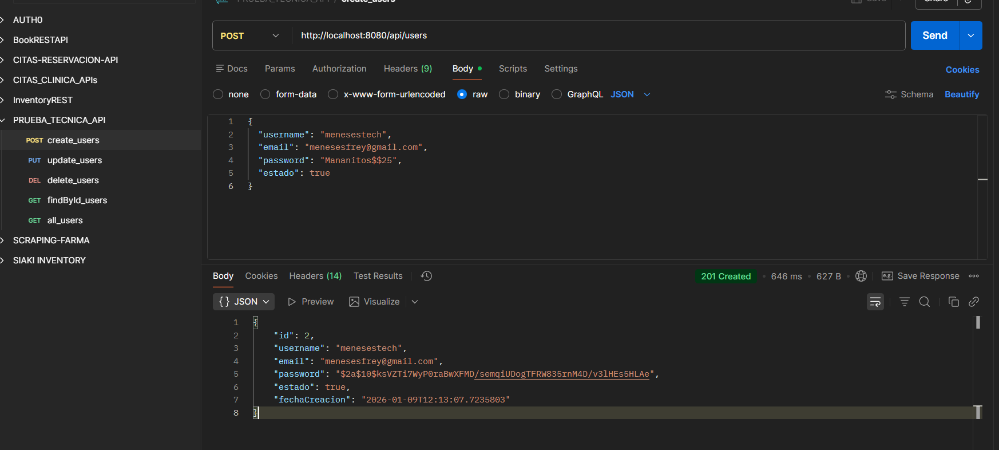

# 📋 Sistema de Gestión de Usuarios (Full Stack)

Este proyecto es una solución profesional para la administración de usuarios, desarrollada como prueba técnica. Implementa una arquitectura desacoplada con un **Backend robusto en Java 21** y un **Frontend reactivo en Angular 21**.

## 🛠️ Stack Tecnológico

### Backend
- **Lenguaje:** Java 21  
- **Framework:** Spring Boot 4.0.1  
- **Seguridad:** Spring Security + JWT (JSON Web Tokens) con jjwt  
- **Mapeo de Entidades:** MapStruct (para conversión limpia de DTOs)  
- **Persistencia:** Spring Data JPA + SQL Server  
- **Productividad:** Lombok  

### Frontend
- **Framework:** Angular 21  
- **Estilos & UI:** CSS / Bootstrap y SweetAlert2 para notificaciones interactivas  
- **Seguridad:** Guards de rutas y jwt-decode para manejo de sesiones

## ⚙️ Configuración Crítica de SQL Server

Para permitir que el Backend se conecte a la base de datos local, siga estrictamente estos pasos:

1. **Habilitar Protocolos:**  
   - Ejecute `Win + R`, escriba `SQLServerManager16.msc` (o la versión correspondiente a su SQL Management Studio 20).  
   - En **SQL Server Network Configuration**, asegúrese de que **TCP/IP** esté en **Enabled**.

2. **Configurar Puerto:**  
   - En las propiedades de TCP/IP, pestaña **IP Addresses**, verifique que en **IPAll** el puerto sea `1433`.

3. **Reiniciar:**  
   - Reinicie el servicio **SQL Server (MSSQLSERVER)** desde la lista de servicios.
 
## 🚀 Guía de Inicio Rápido

### 1. Preparación de Base de Datos
Ejecute el script SQL incluido en la carpeta `/database-sql` utilizando **SQL Server Management Studio 20**.  
Esto creará la base de datos `BD_USERS`.

### 2. Ejecución del Backend
1. Ingrese a la carpeta `user-management-api-backend/`.  
2. Configure el archivo `src/main/resources/application.yml` con sus credenciales:
```bash
spring:
  datasource:
    url: jdbc:sqlserver://localhost:1433;trustServerCertificate=true;databaseName=BD_USERS
    username: sa
    password: {tu_password}
  jpa:
    show-sql: true
    hibernate:
      ddl-auto: update
```
3. Ejecute el comando:

```bash
mvn spring-boot:run
```
### 3. Ejecución del Frontend
1. Ingrese a la carpeta `frontend/`.  
2. Instale las dependencias necesarias:

```bash
npm install
```

3. Inicie la aplicación:
```bash
npm start
```

## 🧪 Pruebas de la API (Postman)
Antes de usar el Frontend, puede verificar el funcionamiento del Backend importando los siguientes detalles en Postman:
Crear Usuario (POST)
- URL: http://localhost:8080/api/users
- Body (JSON):
```bash
{
  "username": "menesestech",
  "email": "menesesfrey@gmail.com",
  "password": "tu_password_aqui",
  "estado": true
}
```


